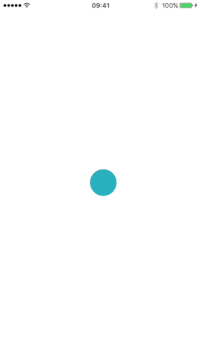
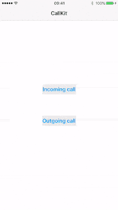
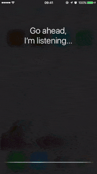
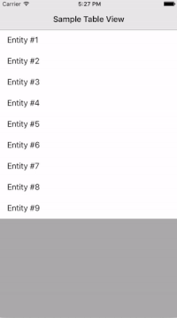
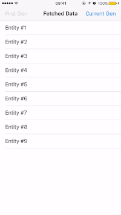
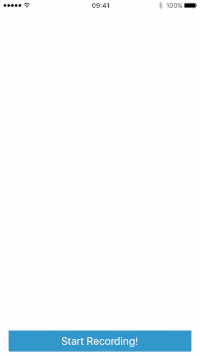
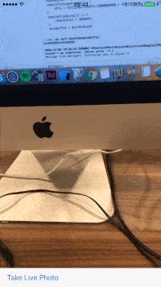
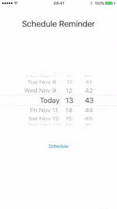
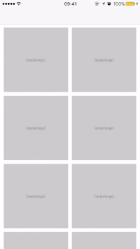
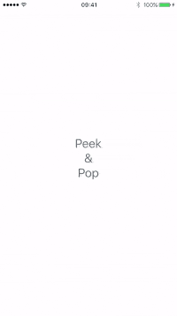

# iOS-10-Sampler
Code examples for the new features of iOS 10 written in Objective-C and Swift 3.0.

## UIViewPropertyAnimator
A **UIViewPropertyAnimator** object lets you animate changes to views and dynamically modify your animations before they finish.  
 

 
## CallKit
The **CallKit** framework provides programmatic access to VoIP functionality, as well as call blocking and identification. 
**Note: This sample requires a device to be built on**  
 

 
## SiriKit
**SiriKit** enables your apps to work with Siri, so users can get things done with your content and services using just their voice. **SiriKit** supports messaging, photo search, phone calls, ride booking and personal payments. 
**Note: This sample requires a device to be built on**  
 

 
## NSPersistentContainer
**NSPersistentContainer** simplifies the creation and management of the Core Data stack by handling the creation of the **NSManagedObjectModel**, **NSPersistentStoreCoordinator**, and the **NSManagedObjectContext**.  
 

 
## NSQueryGenerationToken
Controls whether and how a managed object context pins itself to database transactions.  
 

 
## Speech Recognition
Using the APIs in the Speech framework you can perform speech transcription of both real-time and recorded audio. 
**Note: This sample requires a device to be built on**  
 

 
## AVCapturePhotoOutput
The **AVCapturePhotoOutput** class provides a unified pipeline for all photography workflows, enabling more sophisticated control and monitoring of the entire capture process and including support for new features such as Live Photos and RAW format capture. 
**Note: This sample requires a device to be built on**  
 

 
## UIGraphicsRenderer
A color-managed block-enabled 64-bit rendering context.  
 

 
## UserNotifications
The **UserNotifications** framework supports the delivery and handling of local and remote notifications. You use the classes of this framework to schedule the delivery of local notifications based on specific conditions, such as time or location.  
 

 
## UICollectionViewDataSourcePrefetching
A protocol that provides advance warning of the data requirements for a collection view, allowing the triggering of asynchronous data load operations.  
 

 
## UIPreviewInteraction
**UIPreviewInteraction** is a class that allows you to have a more fine-grained control over what you can do with 3D Touch. It allows you to plug in to the progress of a 3D Touch action on any view that you specify. 
**Note: This sample requires a device to be built on**    
 

 
